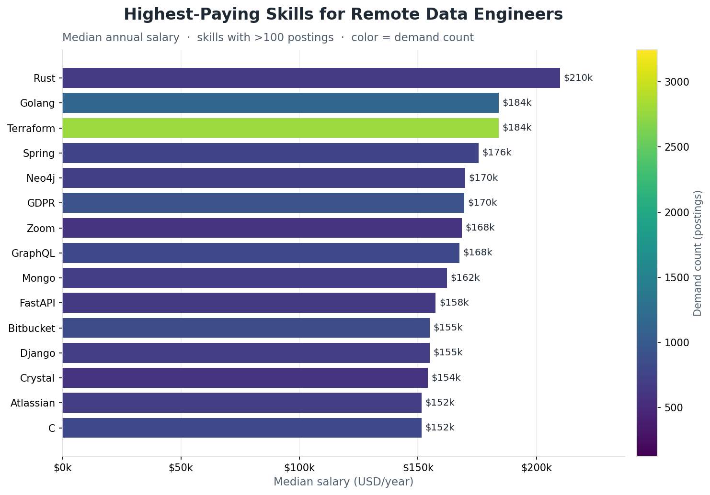

# Data Engineer Job Market — SQL Skills Analysis

An SQL analysis of the remote **Data Engineer** job market, exploring which skills are most in demand, which pay the most, and which offer the best balance of the two. The goal is to give job seekers and professionals a data-driven view of where to focus their skill development.

## Table of Contents

- [Overview](#overview)
- [Background & Questions](#background--questions)
- [Data Model](#data-model)
- [Tools Used](#tools-used)
- [The Queries](#the-queries)
  - [1. Top Demanded Skills](#1-top-demanded-skills)
  - [2. Top Paying Skills](#2-top-paying-skills)
  - [3. Optimal Skills](#3-optimal-skills)
- [Key Findings](#key-findings)
- [How to Run](#how-to-run)
- [Notes & Caveats](#notes--caveats)

## Overview

The analysis focuses exclusively on **remote** (`job_work_from_home = True`) Data Engineer roles. Each query answers a distinct question about the skills market and, where relevant, restricts to postings that have a specified annual salary. Results are embedded as comments at the bottom of each `.sql` file so you can review the output without re-running the queries.

| File | Question it answers |
| --- | --- |
| `01_top_demanded_skills.sql` | Which skills appear most often in remote Data Engineer postings? |
| `02_top_paying_skills.sql` | Which skills are associated with the highest median salaries? |
| `03_optimal_skills.sql` | Which skills best balance high demand *and* high pay? |

## Background & Questions

The market rewards different skills in different ways: some are ubiquitous but pay average wages, others pay handsomely but are rarely required. The three queries were designed to separate these signals and then reconcile them:

1. **Demand** — What are employers asking for most often?
2. **Pay** — What commands the highest compensation?
3. **Optimal** — Which skills are worth learning first, weighing both demand and pay together?

## Data Model

The queries join three tables plus a fact table:

- `job_postings_fact` (`jpf`) — one row per job posting (title, salary, remote flag, etc.).
- `skills_job_dim` (`sjd`) — bridge table linking postings to skills.
- `skills_dim` (`sd`) — one row per skill (skill name).

Relationship: `job_postings_fact.job_id → skills_job_dim.job_id` and `skills_job_dim.skill_id → skills_dim.skill_id`.

Common filters across the queries:

- `job_title_short` matches Data Engineer (via `= 'Data Engineer'` or `ILIKE '%Data Engineer%'`).
- `job_work_from_home = True` (remote only).
- `salary_year_avg IS NOT NULL` (queries 2 and 3, where pay is measured).

## Tools Used

- **SQL** — all analysis logic.
- **PostgreSQL / DuckDB** — the queries use `MEDIAN()`, `LN()`, `ILIKE`, and `ROUND()`; the embedded result tables use DuckDB's box-drawing output format. The syntax runs on either engine with minor adjustments.

## The Queries

### 1. Top Demanded Skills

Counts how many remote Data Engineer postings mention each skill and returns the top 10.

```sql
SELECT
    sd.skills,
    COUNT(jpf.job_id) AS demand_count
FROM job_postings_fact AS jpf
INNER JOIN skills_job_dim AS sjd ON jpf.job_id = sjd.job_id
INNER JOIN skills_dim AS sd ON sjd.skill_id = sd.skill_id
WHERE jpf.job_title_short = 'Data Engineer'
    AND jpf.job_work_from_home = True
GROUP BY sd.skills
ORDER BY demand_count DESC
LIMIT 10;
```

The file also includes an `ILIKE '%Data Engineer%'` variant, which broadens the match (e.g. picking up senior/lead titles) and produces slightly higher counts.


SQL and Python dominate demand and are effectively required, followed by the cloud (AWS, Azure) and big-data (Spark, Airflow, Snowflake) stack.

### 2. Top Paying Skills

Calculates the **median** annual salary per skill (median is used instead of average to blunt the effect of outlier salaries) alongside a demand count.

```sql
SELECT
    sd.skills,
    ROUND(MEDIAN(jpf.salary_year_avg), 2) AS median_salary,
    COUNT(sjd.job_id) AS demand_count
FROM job_postings_fact AS jpf
INNER JOIN skills_job_dim AS sjd ON jpf.job_id = sjd.job_id
INNER JOIN skills_dim AS sd ON sjd.skill_id = sd.skill_id
WHERE jpf.job_title_short ILIKE 'Data Engineer%'
    AND jpf.job_work_from_home = True
    AND jpf.salary_year_avg IS NOT NULL
GROUP BY sd.skills
HAVING COUNT(sjd.job_id) > 100   -- variant that filters out rare, noisy skills
ORDER BY median_salary DESC
LIMIT 25;
```

The file shows three passes: raw median ranking, a version without the salary filter, and a `HAVING COUNT(...) > 100` version that removes low-sample skills (where a handful of postings can inflate the median).



The top of the pay chart is dominated by specialized languages and infrastructure tools (Rust, Golang, Terraform, Spring). Color encodes demand — most high-paying skills are comparatively niche, with Terraform the notable exception (both well-paid and widely required).

### 3. Optimal Skills

Combines demand and pay into a single **weighted score** so high-value skills float to the top. Demand is dampened with a natural log so that raw frequency does not overwhelm salary, then multiplied by the median salary:

```
weighted_score = MEDIAN(salary_year_avg) * LN(COUNT(*)) / 1,000,000
```

```sql
SELECT
    sd.skills,
    ROUND(MEDIAN(jpf.salary_year_avg), 0) AS median_salary,
    COUNT(jpf.job_id) AS demand_count,
    ROUND(LN(COUNT(jpf.job_id)), 2) AS ln_demand_count,
    ROUND((MEDIAN(jpf.salary_year_avg) * LN(COUNT(jpf.job_id)) / 1000000), 2) AS weighted_score
FROM job_postings_fact AS jpf
INNER JOIN skills_job_dim AS sjd ON jpf.job_id = sjd.job_id
INNER JOIN skills_dim AS sd ON sjd.skill_id = sd.skill_id
WHERE jpf.job_title_short = 'Data Engineer'
    AND jpf.job_work_from_home = True
    AND jpf.salary_year_avg IS NOT NULL
GROUP BY sd.skills
HAVING COUNT(jpf.job_id) > 100
ORDER BY weighted_score DESC
LIMIT 25;
```


Plotting demand against pay reveals the sweet spot: Python and SQL sit far to the right (huge demand at solid pay), Terraform sits high up (top pay at moderate demand), and Airflow, Spark, Kafka, and Snowflake cluster in the upper-middle as strong all-rounders. Bubble size and color reflect the combined weighted score.

## Key Findings

**Most in demand (top 10 remote Data Engineer skills):** SQL and Python lead by a wide margin, followed by the cloud and big-data stack.

| Skill | Demand count |
| --- | --- |
| SQL | 29,221 |
| Python | 28,776 |
| AWS | 17,823 |
| Azure | 14,143 |
| Spark | 12,799 |
| Airflow | 9,996 |
| Snowflake | 8,639 |
| Databricks | 8,183 |
| Java | 7,267 |
| GCP | 6,446 |

**Highest paying (median salary, filtered to >100 postings):** specialized and infrastructure-oriented skills top the pay charts, though many are comparatively niche.

| Skill | Median salary |
| --- | --- |
| Rust | $210,000 |
| Golang | $184,000 |
| Terraform | $184,000 |
| Spring | $175,500 |
| Neo4j | $170,000 |
| GDPR | $169,616 |
| Kubernetes | $150,500 |

**Most optimal (best balance of demand and pay):** the weighted score reconciles the two, and the everyday data-engineering core rises back to the top — with Terraform standing out as both high-paying and reasonably demanded.

| Skill | Median salary | Demand count | Weighted score |
| --- | --- | --- | --- |
| Terraform | $184,000 | 193 | 0.97 |
| Python | $135,000 | 1,133 | 0.95 |
| SQL | $130,000 | 1,128 | 0.91 |
| AWS | $137,320 | 783 | 0.91 |
| Airflow | $150,000 | 386 | 0.89 |
| Spark | $140,000 | 503 | 0.87 |
| Kafka | $145,000 | 292 | 0.82 |
| Snowflake | $135,500 | 438 | 0.82 |

**Takeaway:** SQL and Python are non-negotiable foundations. Layering in cloud (AWS/Azure), orchestration (Airflow), big-data processing (Spark/Kafka), the warehouse (Snowflake), and infrastructure-as-code (Terraform) offers the strongest combination of employability and pay for a remote Data Engineer.

## How to Run

1. Load the job-postings dataset into a PostgreSQL or DuckDB database containing the `job_postings_fact`, `skills_job_dim`, and `skills_dim` tables.
2. Open any of the `.sql` files and run the active query (the primary query is at the top; commented blocks below it are alternate versions and cached results).
3. Compare your output against the result tables embedded in the file comments.

To regenerate the charts in this README, run `python3 make_charts.py` (requires `matplotlib`). It writes the three `chart_0*.png` files referenced above.

## Notes & Caveats

- **Title matching:** `= 'Data Engineer'` is exact; `ILIKE '%Data Engineer%'` is broader and yields higher counts. Both appear in the files, so counts differ slightly between variants.
- **Small sample sizes:** In the unfiltered pay query, some skills rank high on a handful of postings (e.g. `ocaml`, `erlang` at 1 posting). The `HAVING COUNT(...) > 100` filter in the later queries addresses this.
- **`COUNT(jpf.*)` / `COUNT(spf.*)`:** Some snippets reference a `spf` alias that isn't defined in the query; use `COUNT(jpf.job_id)` or `COUNT(sjd.job_id)` for a portable count.
- **Median support:** `MEDIAN()` is native to DuckDB and PostgreSQL exposes it via `PERCENTILE_CONT(0.5) WITHIN GROUP (ORDER BY ...)`; adjust if your engine differs.
