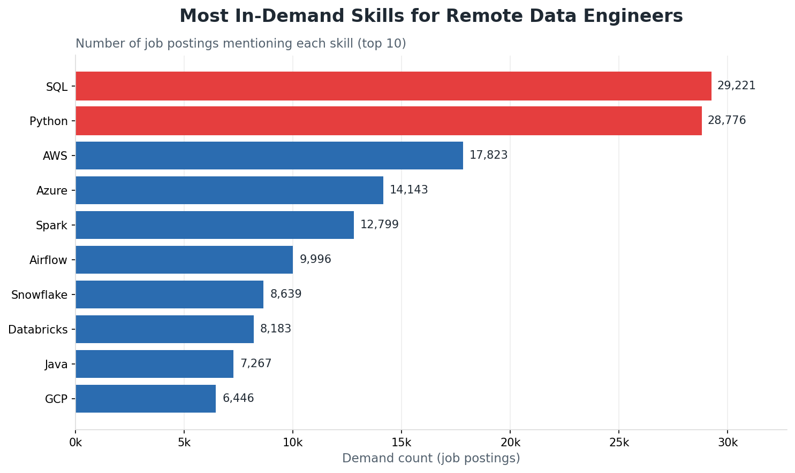
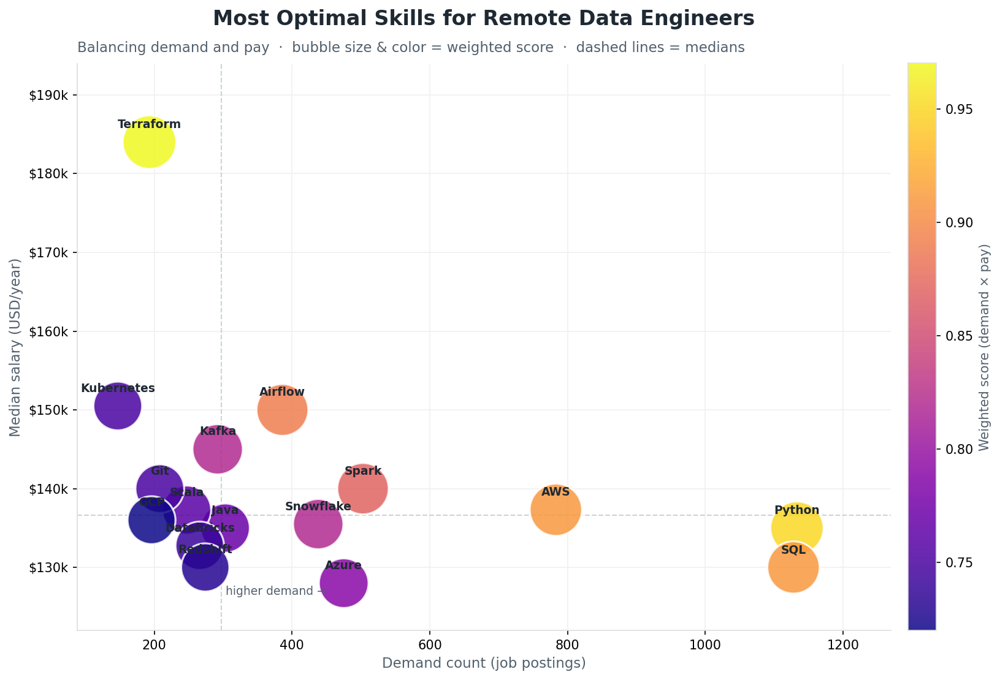

# 🗄️ Data Engineering with SQL

Welcome! This repository documents my journey learning **SQL for data engineering and analytics** — from the very first `SELECT` all the way to a full, insight-driven analysis of the tech job market. Every query is hands-on and runnable, built on a real-world dataset of job postings.

The repo is organized into two parts: a **Lessons** track that builds SQL fundamentals step by step, and a **capstone project** that applies those skills to answer real questions about the Data Engineer job market.

> 🔗 GitHub: [Data-engineering-tutorial-project](https://github.com/Ohaya-Michael/Data-engineering-tutorial-project)

---

## 📑 Table of Contents

- [Repository Structure](#-repository-structure)
- [Part 1 — Lessons (SQL Fundamentals)](#-part-1--lessons-sql-fundamentals)
- [Part 2 — Project (Skills Analysis)](#-part-2--project-skills-analysis)
- [Key Findings](#-key-findings)
- [Dataset & Schema](#-dataset--schema)
- [Getting Started](#-getting-started)
- [Skills Demonstrated](#-skills-demonstrated)
- [Tools](#-tools)
- [Author](#-author)

---

## 📂 Repository Structure

```
Data-engineering-tutorial-project/
│
├── Lessons/                     # SQL fundamentals, lesson by lesson
│   ├── Basic_commands.sql
│   ├── Mid_level_commands.sql
│   ├── Advance_commands.sql
│   ├── joins.sql
│   ├── order_of_execution.sql
│   └── README.md
│
├── 1_project/                   # Capstone: Data Engineer skills analysis
│   ├── 01_top_demanded_skills.sql
│   ├── 02_top_paying_skills.sql
│   ├── 03_optimal_skills.sql
│   ├── make_charts.py
│   ├── images/                  # Generated charts
│   └── README.md
│
└── README.md                    # You are here
```

[⬆ Back to top](#-table-of-contents)

---

## 📘 Part 1 — Lessons (SQL Fundamentals)

A structured path through the core of SQL. Each file is a self-contained lesson with runnable queries and results embedded as comments.

| Lesson | Topics |
| --- | --- |
| [`Basic_commands.sql`](Lessons/Basic_commands.sql) | `SELECT`, `FROM`, `WHERE`, `IS NOT NULL`, `ORDER BY`, `LIMIT` |
| [`Mid_level_commands.sql`](Lessons/Mid_level_commands.sql) | `LIKE` & wildcards (`%`, `_`), aliases (`AS`), `AND` / `OR` / `NOT` |
| [`Advance_commands.sql`](Lessons/Advance_commands.sql) | `BETWEEN`, `IN`, multi-condition business logic |
| [`joins.sql`](Lessons/joins.sql) | `LEFT`, `RIGHT`, `INNER`, `FULL OUTER` joins across tables |
| [`order_of_execution.sql`](Lessons/order_of_execution.sql) | `COUNT`, `GROUP BY`, `HAVING`, SQL order of execution |

👉 Full details in the [Lessons README](Lessons/README.md).

**SQL order of execution** — the key mental model from this track:

```
FROM → WHERE → GROUP BY → aggregate functions → HAVING → SELECT → ORDER BY → LIMIT
```

[⬆ Back to top](#-table-of-contents)

---

## 📊 Part 2 — Project (Skills Analysis)

The capstone applies the fundamentals to a real question: **which skills are most valuable for remote Data Engineers?** Three analyses look at demand, pay, and the optimal balance of the two.

| Query | Question |
| --- | --- |
| [`01_top_demanded_skills.sql`](1_project/01_top_demanded_skills.sql) | Which skills appear most often in remote Data Engineer postings? |
| [`02_top_paying_skills.sql`](1_project/02_top_paying_skills.sql) | Which skills command the highest median salaries? |
| [`03_optimal_skills.sql`](1_project/03_optimal_skills.sql) | Which skills best balance high demand *and* high pay? |

👉 Full write-up in the [Project README](1_project/README.md).

<p align="center">
  
  <br><br>
  
</p>

[⬆ Back to top](#-table-of-contents)

---

## 🔑 Key Findings

- **Most in demand:** SQL and Python are effectively required, followed by AWS, Azure, Spark, Airflow, and Snowflake.
- **Highest paying:** specialized tools like Rust, Golang, Terraform, and Spring top the median-salary charts, though many are niche.
- **Most optimal (demand × pay):** Python, SQL, and AWS as high-value foundations, with Terraform, Airflow, Spark, and Kafka as the differentiators that lift both employability and salary.

**Takeaway:** master the fundamentals (SQL + Python + a cloud platform), then layer in orchestration and infrastructure-as-code to stand out.

[⬆ Back to top](#-table-of-contents)

---

## 🗂️ Dataset & Schema

All queries run against a jobs dataset with the following tables:

| Table | Description |
| --- | --- |
| `job_postings_fact` | One row per job posting — title, location, salary, remote flag, schedule, platform, dates. |
| `company_dim` | One row per company — name and links. |
| `skills_dim` | One row per skill (e.g. `sql`, `python`, `aws`). |
| `skills_job_dim` | Bridge table linking postings to skills (many-to-many). |

Relationships: `job_postings_fact.company_id → company_dim.company_id` and `job_postings_fact.job_id → skills_job_dim.job_id → skills_dim.skill_id`.

[⬆ Back to top](#-table-of-contents)

---

## 🚀 Getting Started

1. Load the dataset into a SQL engine — these queries were run in **DuckDB** (PostgreSQL works with minor tweaks).
2. Browse the [`Lessons/`](Lessons/) folder to follow the fundamentals, or jump to [`1_project/`](1_project/) for the analysis.
3. Run the query at the top of any `.sql` file and compare against the embedded result tables.
4. To regenerate the project charts: `python 1_project/make_charts.py` (requires `matplotlib`).

[⬆ Back to top](#-table-of-contents)

---

## 🎯 Skills Demonstrated

- Core retrieval: `SELECT`, `FROM`, `WHERE`, `ORDER BY`, `LIMIT`
- `NULL` handling, pattern matching (`LIKE`, `%`, `_`), and aliasing (`AS`)
- Boolean logic: `AND`, `OR`, `NOT`, `BETWEEN`, `IN`
- All four joins across a fact/dimension schema
- Aggregation with `COUNT`, `MEDIAN`, `GROUP BY`, and `HAVING`
- Designing a weighted metric (median salary × log-scaled demand)
- Reasoning about SQL's logical order of execution
- Translating query output into charts and clear insights

[⬆ Back to top](#-table-of-contents)

---

## 🛠️ Tools

- **SQL** (DuckDB / PostgreSQL compatible)
- **DuckDB** — running queries and generating result tables
- **Python** (`matplotlib`) — visualizing the analysis results

[⬆ Back to top](#-table-of-contents)

---

## 👤 Author

**Michael Ohaya**
Open to Data Engineering / Data Analytics opportunities.

- GitHub: [Ohaya-Michael](https://github.com/Ohaya-Michael)

[⬆ Back to top](#-table-of-contents)
